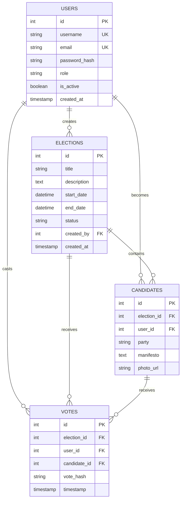

# Database ER Diagram

## Entity-Relationship Diagram

## Relationships Explained

### Users to Elections (One-to-Many)
- One user (admin) can create multiple elections
- Each election is created by one user

### Users to Candidates (One-to-Many)
- One user can be a candidate in multiple elections
- Each candidate entry is linked to one user

### Users to Votes (One-to-Many)
- One user can cast multiple votes (in different elections)
- Each vote is cast by one user

### Elections to Candidates (One-to-Many)
- One election can have multiple candidates
- Each candidate belongs to one election

### Elections to Votes (One-to-Many)
- One election can receive multiple votes
- Each vote belongs to one election

### Candidates to Votes (One-to-Many)
- One candidate can receive multiple votes
- Each vote is for one candidate

## Cardinality Rules

1. **One vote per user per election**: Enforced by unique constraint `(election_id, user_id)`
2. **Active elections only**: Status field restricts voting to active elections
3. **Date validation**: Start date must be before end date
4. **Role-based access**: Only admins can create elections
