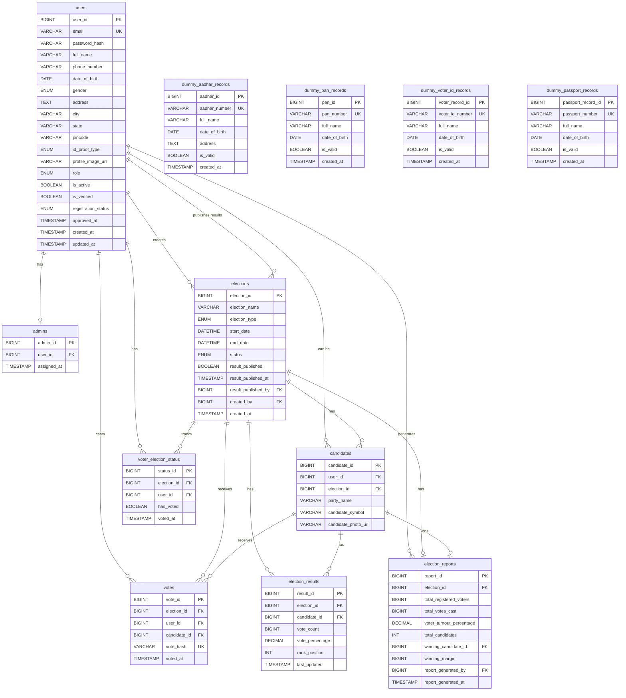

*Visual representation of the database schema*

```mermaid
erDiagram
    users ||--o| admins : "has"
    users ||--o{ candidates : "can be"
    users ||--o{ votes : "casts"
    users ||--o{ voter_election_status : "has"
    users ||--o{ elections : "creates"
    users ||--o{ elections : "publishes results"
    users ||--o{ election_reports : "generates"
    
    elections ||--o{ candidates : "has"
    elections ||--o{ votes : "receives"
    elections ||--o{ voter_election_status : "tracks"
    elections ||--o{ election_results : "has"
    elections ||--o| election_reports : "has"
    
    candidates ||--o{ votes : "receives"
    candidates ||--o{ election_results : "has"
    candidates ||--o| election_reports : "wins"
    
    users {
        BIGINT user_id PK
        VARCHAR email UK
        VARCHAR password_hash
        VARCHAR full_name
        VARCHAR phone_number
        DATE date_of_birth
        ENUM gender
        TEXT address
        VARCHAR city
        VARCHAR state
        VARCHAR pincode
        ENUM id_proof_type
        VARCHAR profile_image_url
        ENUM role
        BOOLEAN is_active
        BOOLEAN is_verified
        ENUM registration_status
        TIMESTAMP approved_at
        TIMESTAMP created_at
        TIMESTAMP updated_at
    }
    
    admins {
        BIGINT admin_id PK
        BIGINT user_id FK
        TIMESTAMP assigned_at
    }
    
    elections {
        BIGINT election_id PK
        VARCHAR election_name
        ENUM election_type
        DATETIME start_date
        DATETIME end_date
        ENUM status
        BOOLEAN result_published
        TIMESTAMP result_published_at
        BIGINT result_published_by FK
        BIGINT created_by FK
        TIMESTAMP created_at
    }
    
    candidates {
        BIGINT candidate_id PK
        BIGINT user_id FK
        BIGINT election_id FK
        VARCHAR party_name
        VARCHAR candidate_symbol
        VARCHAR candidate_photo_url
    }
    
    votes {
        BIGINT vote_id PK
        BIGINT election_id FK
        BIGINT user_id FK
        BIGINT candidate_id FK
        VARCHAR vote_hash UK
        TIMESTAMP voted_at
    }
    
    voter_election_status {
        BIGINT status_id PK
        BIGINT election_id FK
        BIGINT user_id FK
        BOOLEAN has_voted
        TIMESTAMP voted_at
    }
    
    election_results {
        BIGINT result_id PK
        BIGINT election_id FK
        BIGINT candidate_id FK
        BIGINT vote_count
        DECIMAL vote_percentage
        INT rank_position
        TIMESTAMP last_updated
    }
    
    election_reports {
        BIGINT report_id PK
        BIGINT election_id FK
        BIGINT total_registered_voters
        BIGINT total_votes_cast
        DECIMAL voter_turnout_percentage
        INT total_candidates
        BIGINT winning_candidate_id FK
        BIGINT winning_margin
        BIGINT report_generated_by FK
        TIMESTAMP report_generated_at
    }
    
    dummy_aadhar_records {
        BIGINT aadhar_id PK
        VARCHAR aadhar_number UK
        VARCHAR full_name
        DATE date_of_birth
        TEXT address
        BOOLEAN is_valid
        TIMESTAMP created_at
    }
    
    dummy_pan_records {
        BIGINT pan_id PK
        VARCHAR pan_number UK
        VARCHAR full_name
        DATE date_of_birth
        BOOLEAN is_valid
        TIMESTAMP created_at
    }
    
    dummy_voter_id_records {
        BIGINT voter_record_id PK
        VARCHAR voter_id_number UK
        VARCHAR full_name
        DATE date_of_birth
        BOOLEAN is_valid
        TIMESTAMP created_at
    }
    
    dummy_passport_records {
        BIGINT passport_record_id PK
        VARCHAR passport_number UK
        VARCHAR full_name
        DATE date_of_birth
        BOOLEAN is_valid
        TIMESTAMP created_at
    }

```